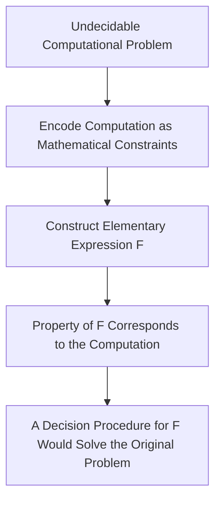

In automated reasoning, one of the deceptively difficult questions is also one of the simplest to state:

$$
E(x) = 0 ;?
$$

For a polynomial, this is a well-understood computational problem. But once sufficiently expressive transcendental functions are introduced, the situation changes dramatically.

Formulated by Daniel Richardson in 1968, Richardson's Theorem established a fundamental limitation of symbolic computation: for a broad class of elementary expressions involving functions such as $\sin$, $\exp$, $\log$, and absolute value, certain basic semantic properties of the expression are undecidable.

In simple terms, there is no universal algorithm that can correctly determine the relevant property for every expression in this class.

The important point is not that some expressions are merely difficult to simplify.

Some instances are computationally undecidable.

---

## Motivation & The Problem Domain

Computer algebra systems routinely need to determine whether an expression is zero.

For example:

$$
x^2 - x^2
$$

can be simplified immediately to:

$$
x^2-x^2 \equiv 0.
$$

Algebraic expressions remain within well-understood computational theories. The situation becomes considerably harder when unrestricted transcendental functions and composition are introduced:

$$
\sin(x), \qquad e^x, \qquad \log(x).
$$

At this point, zero-testing is no longer simply a matter of finding a better symbolic simplification rule. For sufficiently expressive classes of elementary functions, the underlying decision problem itself becomes undecidable.

### The Core Issue: The Zero-Testing Problem

Automated reasoning systems frequently encounter questions such as:

Is $E(x)=0$?
Is $E(x)>0$?
Is $E(x)\neq0$?

These questions can appear inside symbolic simplification, constraint solving, formal verification, and SMT procedures.

If the expression language is sufficiently expressive, however, no complete algorithm can answer every such question.

This creates a fundamental boundary for automated reasoning:

> A reasoning system cannot generally support unrestricted expressive transcendental functions while also guaranteeing complete decision procedures for all semantic properties.

---

## Mathematical Formulation

Let $\mathcal{E}$ denote a class of real-valued elementary expressions generated from variables, rational constants, arithmetic operations, and a sufficiently expressive collection of elementary functions.

Two natural decision problems are:

$$
\exists x\in\mathbb{R}: E(x)=0
$$

and

$$
\forall x\in\mathbb{R}: E(x)=0.
$$

For restricted expression classes, these questions may be decidable.

For sufficiently expressive classes, Richardson's theorem establishes that no algorithm can decide certain such properties for every possible expression.

### Theorem Statement

> For a sufficiently expressive class of elementary functions, determining whether an expression satisfies certain semantic properties, including whether it has a real zero or is identically zero, is undecidable.

The exact formulation depends on the permitted expression class and the semantic property being considered. The essential result is that sufficiently expressive elementary-function languages can encode undecidable computational problems.

---

## Proof Logic & Reduction Mechanism

Richardson's construction follows the standard strategy of reduction: encode an undecidable computational problem into a question about an elementary mathematical expression.

At a high level:

The underlying idea is closely related to the use of Diophantine equations in computability theory. Through results culminating in Matiyasevich's theorem, computational behavior can be represented using polynomial equations over the integers.

Elementary functions can then be used to encode discrete constraints inside a continuous real-valued expression.

### Logical Proof Steps

Diophantine Encoding: Computations can be represented through systems of integer constraints and, ultimately, Diophantine equations.

Encoding Integer Structure: Trigonometric functions provide a mechanism for representing integer-valued constraints over the reals. For example,

$$
\sin(\pi x)=0
$$

whenever $x$ is an integer.

Reductive Construction: An elementary expression $F$ can be constructed so that a semantic property of $F$ corresponds to the behavior of the encoded computation.
Undecidability Inheritance: If an algorithm could always decide that property of $F$, it could also decide the original undecidable computational problem.

Therefore, no such general decision procedure can exist.

---

## Why This Matters for Automated Reasoning

Richardson's theorem might initially appear to be a result about computer algebra.

Its implications are much broader.

A symbolic reasoning engine constantly encounters expressions whose values or relationships must be determined:

$$
E(x)=0,
$$

$$
E(x)>0,
$$

or

$$
E(x)\neq0.
$$

These predicates can occur inside larger procedures for proving formulas, simplifying constraints, checking branches, and solving satisfiability problems.

If the underlying expression language crosses the undecidability boundary, exact reasoning over every possible input is impossible.

This means practical reasoning systems must make a choice.

They can:

- restrict the supported theory,
- use incomplete procedures,
- or replace exact reasoning with sound approximations.

---

## Theoretical Workarounds in Computer Science

Because unrestricted reasoning over sufficiently expressive elementary functions is undecidable, practical computational systems operate within carefully chosen boundaries.

### 1. Decidable Subsets

One approach is to restrict the theory to a decidable fragment.

For example, the first-order theory of real closed fields supports polynomial equalities and inequalities over the reals and is decidable.

Algorithms such as Cylindrical Algebraic Decomposition (CAD) can provide complete decision procedures for this setting.

The trade-off is expressive power.

Once unrestricted transcendental functions are introduced, these decidability guarantees no longer apply automatically.

### 2. Incomplete Procedures

A second approach is to use algorithms that work extremely well on practical instances without guaranteeing a definitive answer for every possible input.

This is common in nonlinear arithmetic solving.

A solver may combine symbolic simplification, algebraic reasoning, numerical procedures, branching, heuristics, and other specialized techniques.

Such procedures can be highly effective while remaining incomplete with respect to the unrestricted mathematical problem.

### 3. Sound Over-Approximation

Another strategy is to replace exact symbolic reasoning with a mathematically sound approximation.

Interval arithmetic is a useful example.

Instead of representing a value with a single floating-point number, an interval computation represents it as:

$$
E(x)\in[a,b].
$$

If:

$$
0\notin[a,b],
$$

then we can soundly conclude:

$$
E(x)\neq0
$$

over the domain represented by that interval.

The important distinction is soundness versus completeness.

An interval procedure may fail to prove that $E(x)\neq0$ even when the statement is true. However, when the resulting interval excludes zero, the conclusion is guaranteed.

This makes interval methods useful for automated reasoning: they can provide mathematical guarantees without requiring complete symbolic characterization of the problem.

---

## Constraint Propagation

Interval arithmetic becomes considerably more powerful when combined with constraint propagation.

Consider a nonlinear constraint such as:

$$
x^2+y^2=1.
$$

Instead of searching blindly over the entire real plane, an interval solver can represent possible values using boxes:

$$
x\in[-1,1], \qquad y\in[-1,1].
$$

Constraints can then be propagated through the expression to contract these intervals.

Regions that cannot contain a solution are removed, while regions that may still contain a solution are preserved.

Conceptually:

$$
\text{Large Search Space}
\longrightarrow
\text{Constraint Contraction}
\longrightarrow
\text{Smaller Search Space}.
$$

This does not overcome Richardson's theorem.

It is instead a practical strategy for reasoning within the boundary imposed by undecidability.

---

## The Bigger Picture

Richardson's theorem reveals a fundamental relationship between expressive power and computational tractability:

$$
\text{More Expressive Language}
;\Longrightarrow;
\text{More Difficult Reasoning}
;\Longrightarrow;
\text{Potential Undecidability}.
$$

Once an expression language becomes sufficiently expressive, there is no clever symbolic algorithm that can restore complete decidability.

Instead, automated reasoning systems must make engineering trade-offs:

$$
\boxed{
\text{Restrict}
\quad|\quad
\text{Approximate}
\quad|\quad
\text{Accept Incompleteness}
}
$$

Modern SMT and nonlinear arithmetic solvers operate within this space.

They combine exact reasoning where possible with incomplete procedures, heuristics, numerical techniques, and sound approximations to solve the instances that arise in practice.

---

## Why Interval Methods Are Interesting

This perspective also explains why interval constraint propagation is useful for nonlinear real arithmetic.

The goal is not to defeat undecidability.

It cannot.

The goal is to construct a sound and computationally useful approximation of the underlying mathematical problem.

An interval contractor can prove that certain regions contain no solution without computing the exact solution set.

Repeated contraction can transform a large continuous search space into a much smaller collection of candidate regions.

In that sense, interval constraint propagation occupies an interesting middle ground:

$$
\text{Exact Symbolic Reasoning}
\quad\longleftrightarrow\quad
\text{Numerical Approximation}.
$$

It retains mathematical guarantees while avoiding the requirement that every semantic question be solved exactly.

---

## Conclusion

Richardson's theorem draws a hard boundary around automated symbolic reasoning.

For sufficiently expressive elementary functions, some seemingly elementary questions cannot be decided algorithmically in general.

The consequence is not that automated reasoning is hopeless.

Rather, it tells us how such systems must be designed.

We restrict the language when completeness matters. We use incomplete procedures when practical performance matters. And when exact reasoning becomes infeasible, we can use sound approximations such as interval arithmetic and constraint propagation.

The interesting engineering problem begins precisely at that boundary:

If we cannot decide everything exactly, how much useful reasoning can we still perform while retaining mathematical guarantees?

That question lies at the heart of practical nonlinear arithmetic solving.